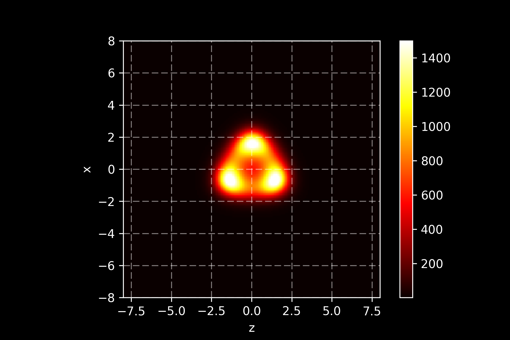
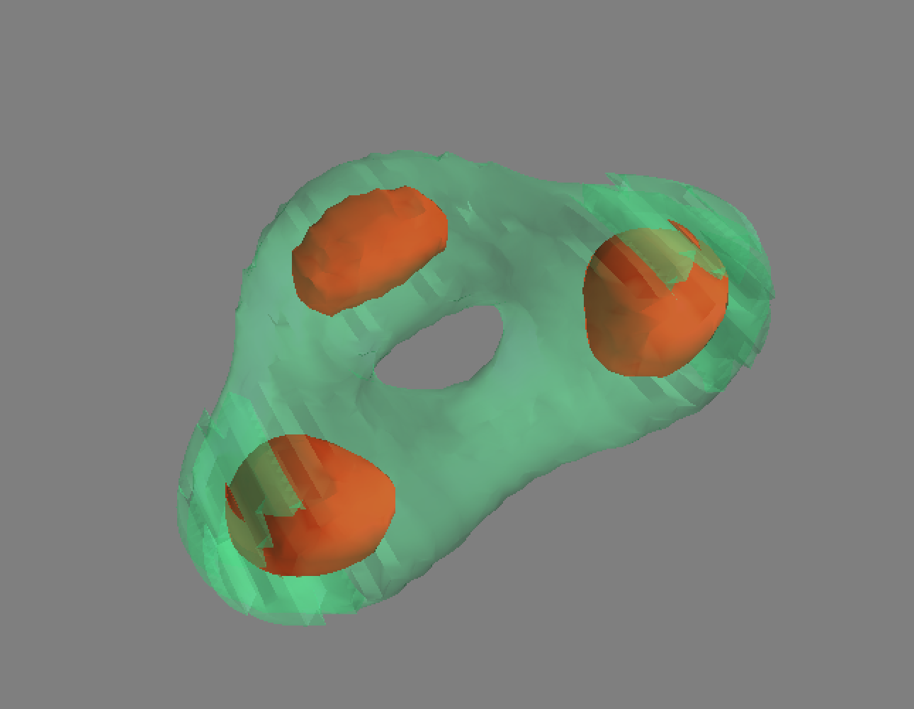
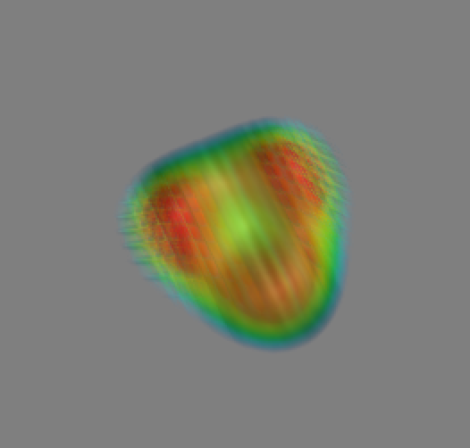

# mayavi_render
The input file ```data/input.txt``` is a plain text file with delimiter as " " and records as "rho x y z".

The notebook first reads in the input file and then makes a 2D distribution of density on z=0 plane for a quick glimpse.
<p align="center">

</p>

After that, I used [[mayavi][http://docs.enthought.com/mayavi/mayavi/]] to render 3D distritution. The 3D plots inlude a 3D scalar field cloud and a 3D countor plot.
<p align="center">

</p>
<p align="center">

</p>
