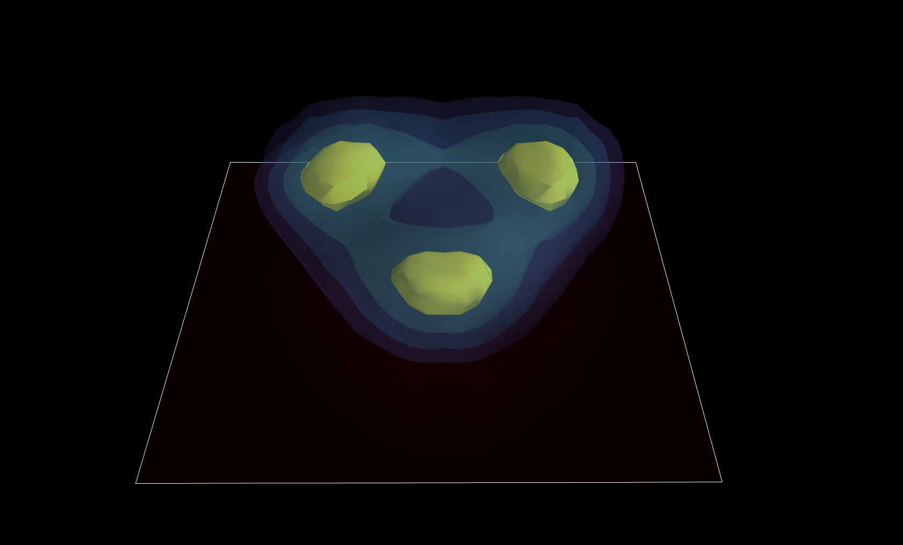
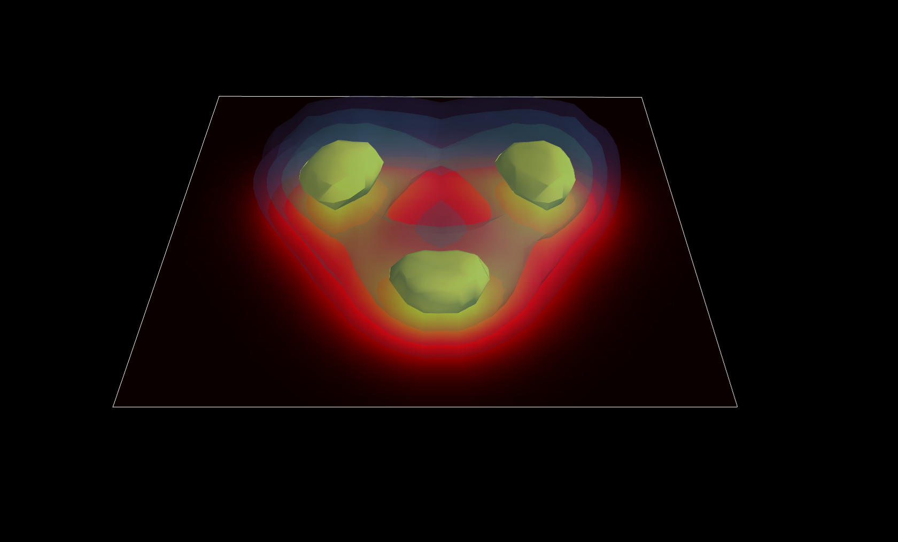

# mayavi_render
The input file ```data/input.txt``` is a plain text file with delimiter as SPACE and records as "rho x y z". in order to visualize the structure of high rho regions with rho-[0.05-0.08], I chose the following exponential color values which enlarge the difference of colors in when rho is higher.
```
color = exp(100*rho)
```

This notebook first reads in the input file and then makes a 2D distribution of density on z=0 plane for a quick glimpse.
<p align="center">

</p>
This is a 2D distribution of density on the z=0 plane. The density data discribes the amplitude squared of proton wavefunction in Carbon nuecleus.

In the second step, I used [**mayavi**](http://docs.enthought.com/mayavi/mayavi/) to render 3D density distritution. Mayavi is a pythonic rendering package based on C++ Visualization Toolkit which based on GPU rendering, not necessarily requring CUDA.

It is a huge pain to set up *mayavi* with *Anaconda3* on mac. The issue is Virtual Evenronment can not call window service via PySide or WX. If you are not using *Anaconda* and any other python distribution, you should go directly to Enthought Phython Distribution [**EPD**](https://www.enthought.com), which is equvalent as **Anaconda** but have 3D rendering included. Once you have EPD installed, you can run these code easily.


The following plots inlude a 3D scalar field plot and a 3D countor plot.

<p align="center">

</p>
<p align="center">
^3D_countor plot^
</p>
In the 3D countor plot, I plot four 3D countors, within which the probability density is constant. Four 3D countors correspond to 
```
rho   = [0.08, 0.067,0.062,0.057]
color = [1200,800,500,300] 
```
<p align="center">

</p>
<p align="center">
^3D_scalarfield plot^
</p>
Also I provided scalar field view of density field.

For Questions -- [Ziheng Chen](https://galleryziheng.wordpress.com) -- zihengchen2015@u.northwestern.edu
